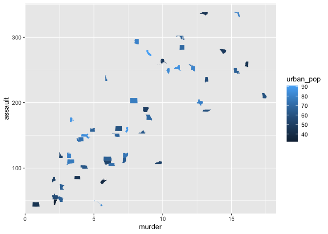

<!-- README.md is generated from README.Rmd. Please edit that file -->

# fontscales

<!-- badges: start -->
<!-- badges: end -->

The goal of fontscales is to …

## Installation

You can install the released version of fontscales from
[CRAN](https://CRAN.R-project.org) with:

``` r
install.packages("fontscales")
```

## StateFace

``` r
library(fontscales)
library(ggplot2)
ggplot(usa_arrests, aes(murder, assault, label = state, color = urban_pop)) +
  geom_stateface()
```



``` r
library(tidyr)
usa_arrests %>%
  pivot_longer(-c(state, urban_pop)) %>%
  ggplot(aes(urban_pop, value, label = state)) +
  geom_stateface() +
  facet_wrap(~name, scales = "free_y")
```


