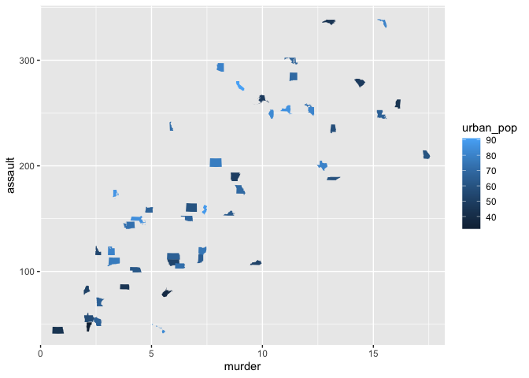
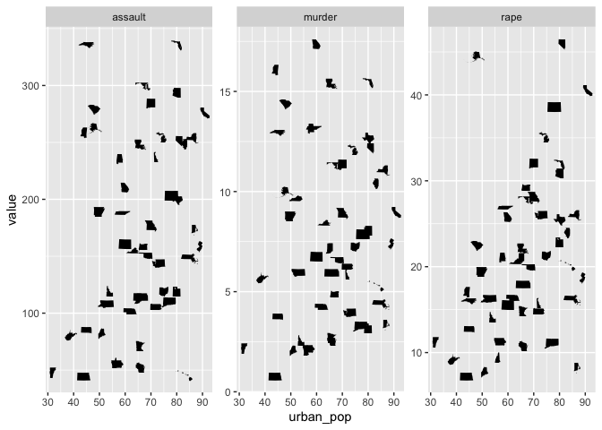

<!-- README.md is generated from README.Rmd. Please edit that file -->

# fontscales

<!-- badges: start -->
<!-- badges: end -->

The goal of fontscales is to is to let you use fancy iconographic fonts
with ease in [ggplot2](https://ggplot2.tidyverse.org/).

## Installation

You can install the dev version of fontscales from
[Github](http://github.com/) with:

``` r
require("devtools")
install_github("tidymodels/fontscales")
```

## StateFace

The [StateFace](https://propublica.github.io/stateface/) font by
[ProPublica](https://www.propublica.org/) contains the 50 different U.S.
states as tiny glyphs and can thus be used in data visualizations.

The data set `usa_arrests` represents a data set where this might be
useful where the `state` variable contains the name of the state

``` r
library(fontscales)
usa_arrests
#> # A tibble: 50 x 5
#>    state       urban_pop murder assault  rape
#>    <chr>           <int>  <dbl>   <int> <dbl>
#>  1 Alabama            58   13.2     236  21.2
#>  2 Alaska             48   10       263  44.5
#>  3 Arizona            80    8.1     294  31  
#>  4 Arkansas           50    8.8     190  19.5
#>  5 California         91    9       276  40.6
#>  6 Colorado           78    7.9     204  38.7
#>  7 Connecticut        77    3.3     110  11.1
#>  8 Delaware           72    5.9     238  15.8
#>  9 Florida            80   15.4     335  31.9
#> 10 Georgia            60   17.4     211  25.8
#> # … with 40 more rows
```

Using `ggplot2` you pass the state name variable to the `label`
aesthetic and use `geom_stateface()` to draw the states. (This should
function similary to `geom_text()` or `geom_point()`).

``` r
library(ggplot2)
ggplot(usa_arrests, aes(murder, assault, label = state, color = urban_pop)) +
  geom_stateface()
```



And other `ggplot2` functions work as expected

``` r
library(tidyr)
usa_arrests %>%
  pivot_longer(-c(state, urban_pop)) %>%
  ggplot(aes(urban_pop, value, label = state)) +
  geom_stateface() +
  facet_wrap(~name, scales = "free_y")
```


